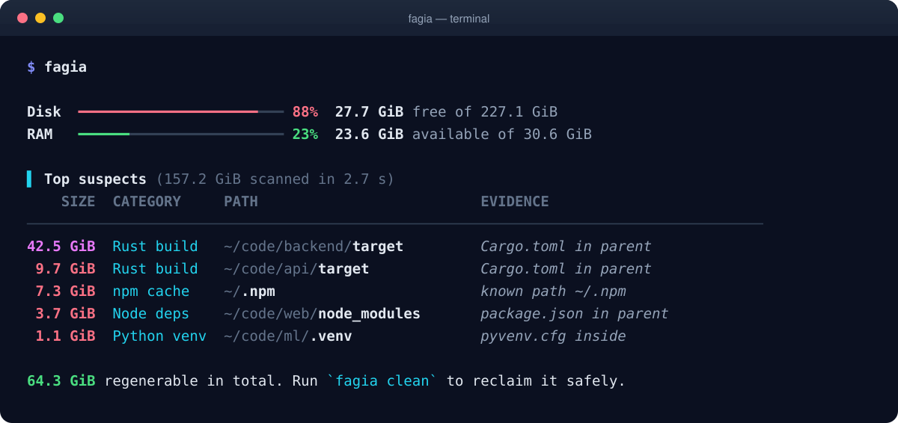

<p align="center">
  
</p>

<p align="center">
  <a href="https://github.com/Chatelo/fagia/actions/workflows/ci.yml"></a>
  
  
  <a href="LICENSE"></a>
</p>

<p align="center">
  <b>fagia</b> <i>(Swahili: “sweep”)</i> finds the build folders, caches, duplicates and forgotten
  processes filling your machine, <b>proves</b> each one is safe to remove, and cleans up without risking your work.
</p>

<p align="center">
  
</p>

## ✨ Highlights

- 🔍 **Finds real junk.** `target/`, `node_modules/`, venvs, caches and more, each with evidence (a `target/` counts only next to a `Cargo.toml`).
- 🧹 **Cleans safely.** Dry run first, then the trash; `fagia undo` puts it back. Nothing outside the scanned folder, nothing git tracks, nothing in use.
- 🪞 **Finds every kind of duplicate.** Identical files and whole folders (removable, keeping your best copy), plus look-alike photos, one song in two formats and edited versions of a document with `--similar`.
- 🧠 **Shows RAM honestly.** Apps ranked by fair share, forgotten dev servers, leak detection, safe quit/pause.
- ⚡ **Fast and accurate.** 1.4 M files in ~4 s, totals within 1% of `du`, hard links counted once.
- 🖥️ **CLI and TUI.** Colourful tables, `--json` for scripts, and a full-screen interface with `fagia ui`.

## 📦 Install

```sh
cargo install --git https://github.com/Chatelo/fagia fagia
```

Linux only for now. Optional helpers: `ffprobe` (ffmpeg) for media, `pdftotext` (poppler-utils) for comparing PDFs, `fpcalc` (chromaprint) for matching songs by sound.

## 🚀 Usage

```sh
fagia                      # disk and RAM at a glance, top suspects
fagia suspects ~/code      # regenerable junk by category
fagia clean ~/code         # dry run → pick → confirm → trash
fagia undo                 # restore the last clean
fagia dupes --similar      # identical and look-alike files, folders
fagia dupes --clean        # keep one copy of each identical set
fagia trash --empty        # trashed items still use space until this
fagia mem                  # apps by memory; --watch 30m finds leaks
fagia ui                   # interactive Disk · RAM · History
```

Run `fagia --help` for every command and flag.

## 🛡️ Safety

Every delete goes through one gate that re-checks each item right before acting: path, evidence, size, git state and open files. Permanent deletes and emptying the trash need a typed confirmation, and every action is logged to `~/.local/state/fagia/actions.jsonl`.

## ⚙️ Configuration

Optional. `fagia config init` writes a commented `~/.config/fagia/config.toml`:

```toml
[protect]
paths = ["~/Documents"]      # never cleaned

[[rule]]                     # teach fagia a new kind of junk
id = "elixir-build"
category = "Elixir build"
kind = "dir"
names = ["_build", "deps"]
require_sibling = ["mix.exs"]
regenerable = true
risk = "low"
```

<details>
<summary><b>🧑‍💻 Development</b></summary>

```sh
cargo test --workspace
cargo clippy --workspace --all-targets -- -D warnings
cargo fmt --all
scripts/check-platform-boundary.sh
```

Built-in rules live in [`rules/builtin.toml`](rules/builtin.toml); benchmarks in [`docs/performance.md`](docs/performance.md). Pull requests are welcome.

</details>

## 📄 License

[MIT](LICENSE) © Benard Ronoh
